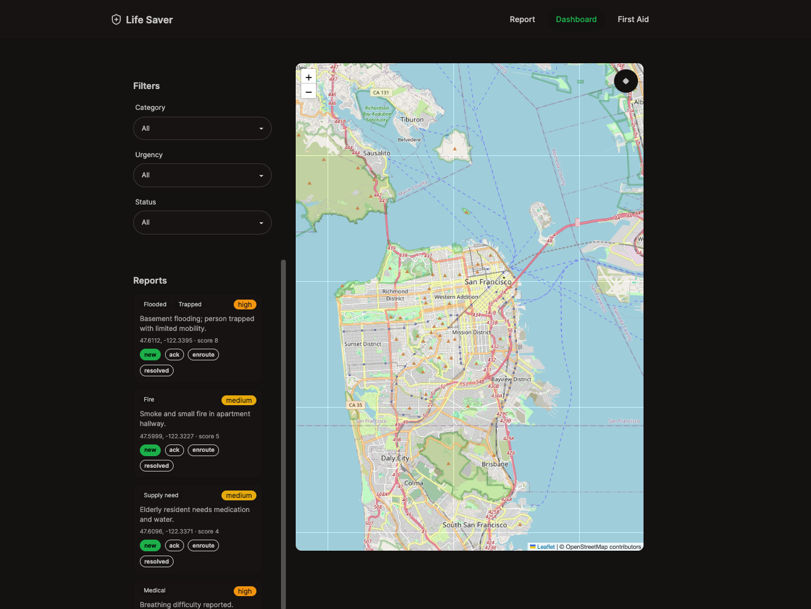
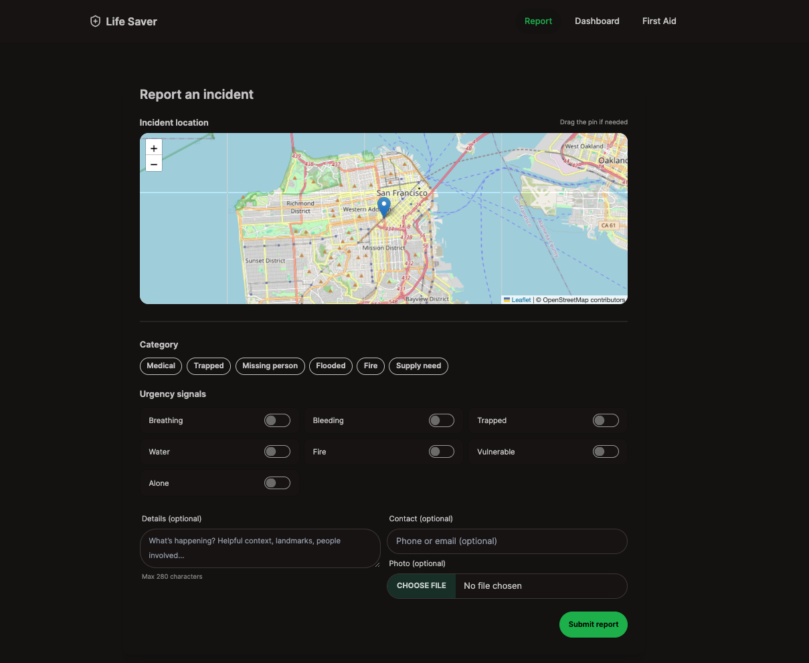
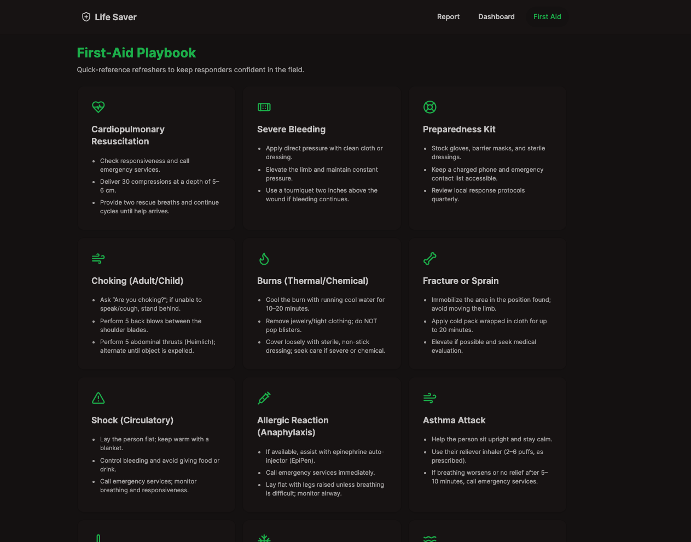

<div align="center">

# 🚨 LifeSaver

### Real-Time Emergency Incident Reporting & Triage Platform

[](https://react.dev)
[](https://typescriptlang.org)
[](https://nodejs.org)
[](https://vitejs.dev)
[](https://tailwindcss.com)
[](https://leafletjs.com)
[](LICENSE)

_Built at the **McMaster Engineering Competition (MEC) Hackathon** — a full-stack emergency response tool that automatically scores and triages crisis reports in real time._

[Features](#-features) · [How Triage Works](#-how-the-triage-algorithm-works) · [Architecture](#-architecture) · [Run Locally](#-running-locally) · [API Reference](#-api-reference)

---

</div>

## 📸 Screenshots

|         Live Incident Map         |          Submit a Report          |         Urgency Triage         |
| :-------------------------------: | :-------------------------------: | :----------------------------: |
|  |  |  |

> _Real incidents. Real map. Automatically scored by severity the moment they're submitted._

---

## 🏆 Hackathon Context

LifeSaver was built at the **McMaster Engineering Competition (MEC) Hackathon** under time pressure with a single goal: what if regular people could report emergencies faster than 911 call queues, and first responders could see a live prioritised map of what's happening right now?

The result is a full-stack platform where anyone can submit a crisis report from their phone, and coordinators see every incident ranked by urgency — automatically, with no human triage needed.

---

## ✨ Features

- 🗺 **Live incident map** — all reports plotted on an interactive Leaflet map with marker clustering
- 🔴 **Automatic urgency scoring** — every report is scored and labelled critical / high / medium / low on submission
- 📍 **Geohash proximity detection** — nearby similar reports boost each other's urgency score
- 📸 **Photo uploads** — attach images to incident reports via Multer
- 🛡 **Built-in rate limiting** — prevents report spam without any external library
- 📦 **Zero-config database** — flat JSON store, no database server needed
- 🌱 **Seed data** — ships with 5 realistic sample incidents pre-loaded
- ⚡ **Vite + TanStack Query** — instant hot reload, smart server-state caching

---

## 🧠 How the Triage Algorithm Works

The most technically interesting part of LifeSaver is the **automatic urgency scoring system** in `lifesaver-server/seed.mjs` and the reports route. When a report is submitted, it is never just stored — it is immediately evaluated.

### The Scoring Function

```
function scoreReport(answers, nearbySimilarCount, hasContact):

  score = 0

  if breathing difficulty OR bleeding  → +4   (immediate life threat)
  if person is trapped                 → +3   (cannot self-rescue)
  if flooding OR fire present          → +3   (environmental danger)
  if vulnerable person involved        → +2   (child, elderly, disabled)
  if person is alone                   → +1   (no immediate help nearby)
  if no contact info given             → +1   (harder to follow up)
  if 2+ similar reports within 200m    → +2   (cluster = confirmed event)

  ─────────────────────────────────────────────
  Total → Urgency Level:

   Score 9+   →  🔴  CRITICAL
   Score 6–8  →  🟠  HIGH
   Score 3–5  →  🟡  MEDIUM
   Score 0–2  →  🟢  LOW
```

### Why Each Weight Matters

| Signal               | Weight | Reasoning                                        |
| -------------------- | :----: | ------------------------------------------------ |
| Breathing / bleeding |   +4   | Highest immediate mortality risk                 |
| Trapped              |   +3   | Person cannot escape without external help       |
| Fire / flooding      |   +3   | Environmental threat that escalates fast         |
| Vulnerable person    |   +2   | Higher injury probability, less self-sufficiency |
| Alone                |   +1   | No bystander first aid possible                  |
| No contact           |   +1   | Reduces ability to coordinate response           |
| Cluster of reports   |   +2   | Corroboration raises confidence in severity      |

### Real Scenario Examples

```
Scenario: Basement flooding, elderly person trapped, no contact info
  breathing: false  bleeding: false  trapped: true   → +3
  water: true       fire: false                      → +3
  vulnerable: true  alone: false                     → +2
  no contact                                         → +1
  ──────────────────────────────────────────
  Score: 9  →  🔴 CRITICAL

Scenario: Breathing difficulty, alone, no contact
  breathing: true                                    → +4
  alone: true                                        → +1
  no contact                                         → +1
  ──────────────────────────────────────────
  Score: 6  →  🟠 HIGH

Scenario: Supply need — elderly resident, alone
  vulnerable: true                                   → +2
  alone: true                                        → +1
  ──────────────────────────────────────────
  Score: 3  →  🟡 MEDIUM
```

### Geohash Proximity Clustering

LifeSaver uses **ngeohash** to encode every report's GPS coordinates into a geohash string at precision 7 (~153m × 153m cell). When a new report comes in, the server checks whether 2 or more reports of the same category exist within 200 metres and the last 30 minutes. If so, the cluster bonus (+2) is applied — because multiple independent reports of the same incident in the same location dramatically increases confidence that a real emergency is occurring.

```
Geohash precision 7  →  ~153m × 153m cells
Cluster threshold    →  2+ same-category reports within 200m in 30 min
Cluster bonus        →  +2 to urgency score  →  can tip medium → high
```

---

## 🏗 Architecture

```
┌─────────────────────────────────────────────────────────────┐
│               Browser  (localhost:5173)                     │
│                                                             │
│  ┌─────────────┐   ┌──────────────┐   ┌─────────────────┐  │
│  │  Leaflet    │   │  Report Form │   │  Incident List  │  │
│  │  Map View   │   │  + Zod valid │   │  + Urgency tags │  │
│  └──────┬──────┘   └──────┬───────┘   └────────┬────────┘  │
│         └─────────────────┼────────────────────┘           │
│                    TanStack Query                           │
│                    React Router v6                          │
└────────────────────────── │ ────────────────────────────────┘
                            │  HTTP / REST
┌────────────────────────── │ ────────────────────────────────┐
│               Node.js + Express  (localhost:4000)           │
│                                                             │
│   POST /reports  ──→  scoreReport()  ──→  store.js         │
│   GET  /reports  ──→  listReports()  ──→  data/db.json     │
│   GET  /health   ──→  { ok: true }                         │
│                                                             │
│   Middleware stack:                                         │
│   cors → json → urlencoded → static → rateLimitMiddleware  │
│                                                             │
│   Rate limit: 1 report per IP per 2 minutes (no library)   │
└─────────────────────────────────────────────────────────────┘
```

**Project structure:**

```
LifeSaver_Final/
├── run.sh                    ← Start everything with one command
├── lifesaver-client/         ← React + TypeScript frontend
│   ├── src/                  ← Components, pages, hooks, API
│   ├── index.html
│   ├── vite.config.ts
│   ├── tailwind.config.ts    ← DaisyUI "forest" theme
│   └── package.json
└── lifesaver-server/         ← Node.js + Express backend
    ├── index.mjs             ← Server entry, middleware, routes
    ├── store.js              ← JSON flat-file database
    ├── seed.mjs              ← Seeds 5 realistic sample reports
    ├── routes/               ← Express route handlers
    ├── data/db.json          ← Auto-created on first run
    └── uploads/              ← Photo uploads (Multer)
```

---

## 🚀 Running Locally

### Prerequisites

- Node.js 18+
- npm 9+

### Option A — One command (recommended)

```bash
git clone https://github.com/YOUR_USERNAME/lifesaver.git
cd lifesaver
bash run.sh
```

This installs dependencies, seeds the database with 5 sample incidents, starts the API on port 4000, and starts the frontend on port 5173 — all automatically.

### Option B — Two terminals (better for debugging)

**Terminal 1 — API server:**

```bash
cd lifesaver-server
npm install
npm run seed      # seeds data/db.json with sample incidents
npm start         # → http://localhost:4000
```

**Terminal 2 — Frontend:**

```bash
cd lifesaver-client
rm -rf node_modules package-lock.json   # prevents Rollup/Mac bug
npm install
npm run dev       # → http://localhost:5173
```

Open **[http://localhost:5173](http://localhost:5173)**

You'll see 5 pre-seeded incidents on the map near Seattle, each colour-coded by urgency level.

---

## 📡 API Reference

Base URL: `http://localhost:4000`

| Method | Endpoint         | Description                                   |
| ------ | ---------------- | --------------------------------------------- |
| `GET`  | `/health`        | Server health check → `{ ok: true }`          |
| `GET`  | `/reports`       | List all incident reports                     |
| `POST` | `/reports`       | Submit a new report (rate limited: 1/IP/2min) |
| `GET`  | `/uploads/:file` | Serve uploaded photo                          |

**POST `/reports` — request body:**

```json
{
  "lat": 47.6062,
  "lng": -122.3321,
  "categories": ["Fire", "Trapped"],
  "answers": {
    "breathing": false,
    "bleeding": false,
    "trapped": true,
    "water": false,
    "fire": true,
    "vulnerable": true,
    "alone": false
  },
  "text": "Fire in stairwell, person trapped on floor 3.",
  "contact": "reporter@example.com"
}
```

**Response — urgency is calculated server-side:**

```json
{
  "id": "a3f9c...",
  "createdAt": "2025-11-09T17:30:00.000Z",
  "lat": 47.6062,
  "lng": -122.3321,
  "geohash": "c23nb3q",
  "categories": ["Fire", "Trapped"],
  "score": 11,
  "urgency": "critical",
  "status": "new"
}
```

---

## 📦 Tech Stack

| Layer              | Technology              | Purpose                        |
| ------------------ | ----------------------- | ------------------------------ |
| Frontend framework | React 18 + TypeScript   | UI, routing, state             |
| Build tool         | Vite 5                  | Dev server, HMR, bundling      |
| Styling            | TailwindCSS 3 + DaisyUI | Utility CSS + component themes |
| Map                | Leaflet + react-leaflet | Interactive incident map       |
| Clustering         | react-leaflet-cluster   | Groups nearby markers          |
| Data fetching      | TanStack Query          | Server state, caching, refetch |
| Routing            | React Router v6         | Client-side navigation         |
| Validation         | Zod                     | Runtime schema validation      |
| Backend            | Node.js + Express (ESM) | REST API                       |
| File uploads       | Multer                  | Photo attachments              |
| Spatial indexing   | ngeohash                | Proximity-based clustering     |
| Database           | JSON flat-file          | Zero-config persistence        |
| Rate limiting      | Custom middleware       | Spam prevention                |

---

## 🛡 Security & Resilience

- **Rate limiting** — custom implementation, 1 report per IP per 2-minute window, with `Retry-After` header on 429 responses
- **Input validation** — Zod schemas on the frontend, Express middleware on the backend
- **DB resilience** — `store.js` auto-creates the data directory and resets to defaults if the JSON is corrupted
- **Automatic DB backups** — `seed.mjs` backs up the existing database before overwriting
- **Error boundary** — global Express error handler catches unhandled exceptions

---

## 📄 License

MIT — see [LICENSE](LICENSE)

---

<div align="center">

_Built under 24-hour hackathon conditions at the McMaster Engineering Competition (MEC) Hackathon._
_Demonstrates full-stack development, real-time mapping, and algorithmic triage logic._

</div>
